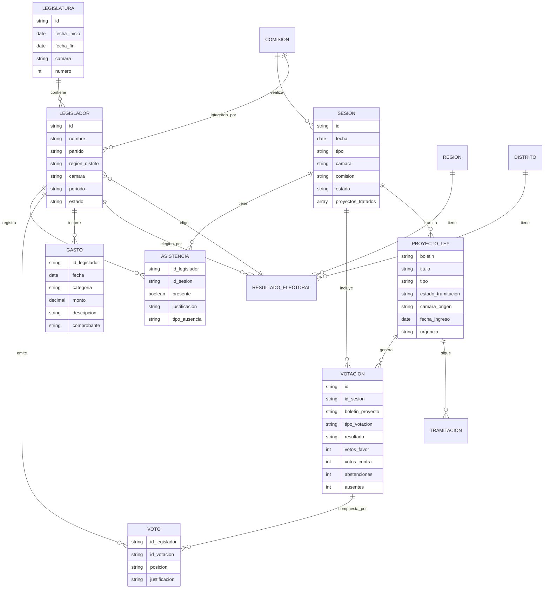
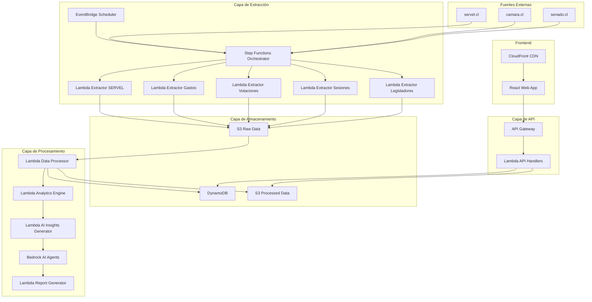
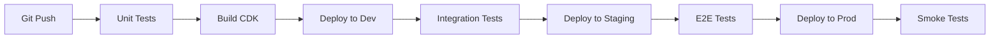

# Documento de Diseño

## Visión General

La plataforma Open Data es una solución serverless construida en AWS que extrae, procesa y presenta datos legislativos chilenos de manera eficiente y escalable. El sistema está diseñado con una arquitectura orientada a eventos que minimiza costos operativos mientras mantiene alta disponibilidad y tiempos de respuesta óptimos.

La arquitectura se basa en tres pilares fundamentales:

1. **Extracción automatizada** de datos desde fuentes gubernamentales
2. **Procesamiento inteligente** para identificar comportamientos problemáticos
3. **Presentación accesible** para ciudadanos con modelo freemium

## Modelo de Información Legislativa Chilena

### Estructura del Congreso Nacional

El sistema legislativo chileno se organiza en dos cámaras con estructuras de información específicas:

**Senado de Chile (senado.cl):**

- **Legislaturas**: Períodos de 8 años (ej: 2018-2026)
- **Senadores**: 50 senadores elegidos por regiones
- **Sesiones**: Ordinarias (marzo-enero) y extraordinarias
- **Comisiones**: Permanentes y especiales
- **Proyectos de Ley**: Tramitación bicameral

**Cámara de Diputados (camara.cl):**

- **Legislaturas**: Períodos de 4 años (ej: 2022-2026)
- **Diputados**: 155 diputados elegidos por distritos
- **Sesiones**: Sala y comisiones
- **Tramitación**: Primera instancia para muchos proyectos

### Relaciones entre Entidades



### Flujos de Información por Fuente

**Senado.cl - Estructura de Datos:**

1. **Legisladores**: `/senadores/` → Perfiles, contactos, comisiones
2. **Sesiones**: `/sesiones/` → Fechas, asistencia, orden del día
3. **Votaciones**: `/votaciones/` → Resultados por proyecto y legislador
4. **Gastos**: `/transparencia/gastos/` → Gastos por categoría y período
5. **Proyectos**: `/tramitacion/` → Estado de proyectos de ley

**Camara.cl - Estructura de Datos:**

1. **Diputados**: `/diputados/` → Perfiles, distritos, comisiones
2. **Sesiones**: `/sesiones-sala/` → Sesiones de sala y comisiones
3. **Votaciones**: `/votaciones/` → Detalles de votaciones
4. **Gastos**: `/transparencia/` → Gastos parlamentarios
5. **Proyectos**: `/proyectos-de-ley/` → Tramitación legislativa

**Servel.cl - Estructura de Datos:**

1. **Elecciones Parlamentarias**: Resultados por región/distrito
2. **Candidatos**: Información de candidatos electos
3. **Votación**: Votos obtenidos por candidato
4. **Circunscripciones**: Mapeo región-distrito-legislador

### Ciclos de Actualización de Datos

**Datos en Tiempo Real:**

- Sesiones en curso: Asistencia y votaciones
- Estado de proyectos: Cambios de tramitación

**Datos Diarios:**

- Nuevas sesiones programadas
- Resultados de votaciones del día
- Actualizaciones de asistencia

**Datos Semanales:**

- Gastos parlamentarios publicados
- Informes de comisiones
- Estadísticas de rendimiento

**Datos Mensuales:**

- Consolidación de métricas
- Reportes de transparencia
- Análisis de tendencias

## Arquitectura

### Arquitectura General



### Estructura de Datos en S3

```
s3://open-data-cl-bucket-{environment}/
├── raw/
│   ├── senado/
│   │   ├── year=2024/
│   │   │   ├── month=01/
│   │   │   │   ├── day=15/
│   │   │   │   │   ├── legisladores.json
│   │   │   │   │   ├── sesiones.json
│   │   │   │   │   ├── votaciones.json
│   │   │   │   │   └── gastos.json
│   ├── camara/
│   │   └── [misma estructura que senado]
│   └── servel/
│       ├── elecciones/
│       │   ├── year=2021/
│       │   │   └── resultados_congreso.json
│       │   └── year=2017/
│           └── resultados_congreso.json
├── processed/
│   ├── senado/
│   │   ├── legisladores/
│   │   │   ├── year=2024/
│   │   │   │   └── month=01/
│   │   │   │       └── legisladores_procesados.parquet
│   │   ├── sesiones/
│   │   │   ├── year=2024/
│   │   │   │   └── month=01/
│   │   │   │       └── sesiones_procesadas.parquet
│   │   ├── votaciones/
│   │   │   ├── year=2024/
│   │   │   │   └── month=01/
│   │   │   │       └── votaciones_procesadas.parquet
│   │   └── gastos/
│   │       ├── year=2024/
│   │       │   └── month=01/
│   │       │       └── gastos_procesados.parquet
│   ├── camara/
│   │   └── [misma estructura que senado]
│   ├── servel/
│   │   └── elecciones/
│   │       ├── year=2021/
│   │       │   └── resultados_procesados.parquet
│   │       └── year=2017/
│   │           └── resultados_procesados.parquet
│   └── analisis/
│       ├── comportamientos_problematicos/
│       │   ├── year=2024/
│       │   │   └── month=01/
│       │   │       └── analisis_comportamientos.parquet
│       ├── metricas_rendimiento/
│       │   ├── year=2024/
│       │   │   └── month=01/
│       │   │       └── metricas_legisladores.parquet
│       └── reportes_ia/
│           ├── year=2024/
│           │   └── month=01/
│           │       └── insights_generados.parquet
└── athena-results/
```

## Componentes e Interfaces

### 1. Sistema de Extracción de Datos con Step Functions

**Orquestador Principal (Step Functions):**

- `ExtractionOrchestrator`: Coordina la extracción completa de todas las fuentes
- Maneja reintentos, paralelización y manejo de errores
- Ejecuta flujos diferenciados para Senado, Cámara y SERVEL

**Extractores Lambda Especializados:**

**Para Senado.cl:**

- `SenadoLegisladoresExtractor`: Extrae perfiles de senadores, comisiones, contactos
- `SenadoSesionesExtractor`: Extrae sesiones de sala y comisiones, orden del día
- `SenadoVotacionesExtractor`: Extrae votaciones con detalle por senador
- `SenadoGastosExtractor`: Extrae gastos por categoría desde transparencia
- `SenadoProyectosExtractor`: Extrae estado de tramitación de proyectos

**Para Camara.cl:**

- `CamaraLegisladoresExtractor`: Extrae perfiles de diputados, distritos, comisiones
- `CamaraSesionesExtractor`: Extrae sesiones de sala y comisiones
- `CamaraVotacionesExtractor`: Extrae votaciones con detalle por diputado
- `CamaraGastosExtractor`: Extrae gastos parlamentarios desde transparencia
- `CamaraProyectosExtractor`: Extrae proyectos de ley y su tramitación

**Para Servel.cl:**

- `ServelEleccionesExtractor`: Extrae resultados electorales por circunscripción
- `ServelCandidatosExtractor`: Extrae información de candidatos electos
- `ServelResultadosExtractor`: Extrae votación detallada por región/distrito

**Flujo de Step Functions:**

```json
{
  "Comment": "Orquestación de extracción de datos legislativos",
  "StartAt": "IniciarExtraccion",
  "States": {
    "IniciarExtraccion": {
      "Type": "Parallel",
      "Branches": [
        {
          "StartAt": "ExtraerSenado",
          "States": {
            "ExtraerSenado": {
              "Type": "Parallel",
              "Branches": [
                {
                  "StartAt": "ExtraerLegisladoresSenado",
                  "States": {
                    "ExtraerLegisladoresSenado": {
                      "Type": "Task",
                      "Resource": "arn:aws:lambda:region:account:function:LegisladoresExtractor",
                      "Parameters": {
                        "source": "senado",
                        "pages": ["legisladores", "senadores-en-ejercicio"]
                      },
                      "Retry": [{ "ErrorEquals": ["States.ALL"], "MaxAttempts": 3 }],
                      "End": true
                    }
                  }
                },
                {
                  "StartAt": "ExtraerSesionesSenado",
                  "States": {
                    "ExtraerSesionesSenado": {
                      "Type": "Task",
                      "Resource": "arn:aws:lambda:region:account:function:SesionesExtractor",
                      "Parameters": {
                        "source": "senado",
                        "pages": ["sesiones", "asistencia"]
                      },
                      "End": true
                    }
                  }
                }
              ],
              "End": true
            }
          }
        },
        {
          "StartAt": "ExtraerCamara",
          "States": {
            "ExtraerCamara": {
              "Type": "Parallel",
              "Branches": [
                {
                  "StartAt": "ExtraerLegisladoresCamara",
                  "States": {
                    "ExtraerLegisladoresCamara": {
                      "Type": "Task",
                      "Resource": "arn:aws:lambda:region:account:function:LegisladoresExtractor",
                      "Parameters": {
                        "source": "camara",
                        "pages": ["diputados", "diputados-en-ejercicio"]
                      },
                      "End": true
                    }
                  }
                }
              ],
              "End": true
            }
          }
        }
      ],
      "Next": "ProcesarDatos"
    },
    "ProcesarDatos": {
      "Type": "Task",
      "Resource": "arn:aws:lambda:region:account:function:DataProcessor",
      "End": true
    }
  }
}
```

**Interfaces:**

```typescript
interface DataExtractor {
  extract(params: ExtractionParams): Promise<RawDataBatch>;
  validate(data: RawDataBatch): ValidationResult;
  store(data: RawDataBatch): Promise<S3Location>;
}

interface ExtractionParams {
  source: 'senado' | 'camara' | 'servel';
  pages: string[];
  dateRange?: {
    start: Date;
    end: Date;
  };
  retryCount?: number;
}

interface RawDataBatch {
  source: 'senado' | 'camara' | 'servel';
  timestamp: Date;
  dataType: 'legislators' | 'sessions' | 'votes' | 'expenses' | 'elections';
  records: Record<string, any>[];
  extractionMetadata: {
    pagesProcessed: string[];
    totalRecords: number;
    processingTime: number;
    errors: string[];
  };
}

interface StepFunctionExecutionResult {
  executionArn: string;
  status: 'SUCCEEDED' | 'FAILED' | 'TIMED_OUT' | 'ABORTED';
  extractedData: {
    senado: RawDataBatch[];
    camara: RawDataBatch[];
    servel: RawDataBatch[];
  };
  errors: ExecutionError[];
  totalProcessingTime: number;
}
```

**Configuración de Scheduling:**

- Extracción diaria: Legisladores, sesiones recientes
- Extracción semanal: Votaciones, gastos
- Extracción mensual: Datos históricos completos
- Extracción bajo demanda: Eventos especiales o actualizaciones urgentes

### 2. Motor de Procesamiento y Análisis

**Procesador Principal:**

- Transforma datos raw JSON en formato Parquet estructurado
- Aplica esquemas consistentes para compatibilidad con Glue/Athena
- Identifica inconsistencias y anomalías en los datos

**Motor de Analytics:**

- Detecta comportamientos problemáticos usando reglas de negocio
- Genera rankings comparativos entre legisladores
- Calcula indicadores de accountability y transparencia

**Generador de Insights con IA:**

- Utiliza Amazon Bedrock para análisis avanzados
- Genera insights narrativos sobre patrones de comportamiento
- Crea resúmenes automáticos para informes premium
- Identifica tendencias emergentes en datos legislativos

**Interfaces:**

```typescript
interface AnalyticsEngine {
  detectProblematicBehavior(legislator: Legislator): ProblematicBehavior[];
  calculatePerformanceMetrics(legislator: Legislator): PerformanceMetrics;
  generateComparativeRankings(legislators: Legislator[]): Ranking[];
}

interface AIInsightsGenerator {
  generateBehaviorInsights(data: LegislatorData[]): Promise<AIInsight[]>;
  createNarrativeSummary(metrics: PerformanceMetrics[]): Promise<string>;
  identifyEmergingTrends(historicalData: HistoricalData): Promise<Trend[]>;
  generatePremiumReportContent(legislator: Legislator): Promise<PremiumContent>;
}

interface AIInsight {
  type: 'pattern_detection' | 'anomaly_identification' | 'trend_analysis' | 'comparative_insight';
  confidence: number;
  narrative: string;
  supportingData: Record<string, any>;
  recommendations: string[];
}

interface ProblematicBehavior {
  type: 'excessive_absence' | 'passive_attendance' | 'excessive_spending' | 'inconsistent_voting';
  severity: 'low' | 'medium' | 'high';
  description: string;
  evidence: Evidence[];
  comparisonToAverage: number;
  aiInsight?: string;
}
```

### 3. API REST

**Endpoints Principales:**

- `GET /api/legislators` - Lista de legisladores con métricas básicas
- `GET /api/legislators/{id}` - Detalle completo de un legislador
- `GET /api/legislators/{id}/problematic-behaviors` - Comportamientos problemáticos
- `GET /api/projects` - Proyectos de ley con estado de tramitación
- `GET /api/analytics/rankings` - Rankings comparativos
- `POST /api/subscriptions` - Gestión de suscripciones premium

**Autenticación:**

- JWT tokens para usuarios registrados
- API Keys para desarrolladores externos
- Rate limiting por usuario/IP

### 4. Frontend Web

**Componentes Principales:**

- `LegislatorCard`: Tarjeta con información básica y alertas
- `ProblematicBehaviorAlert`: Componente para destacar comportamientos problemáticos
- `PerformanceChart`: Gráficos de rendimiento comparativo
- `RegionalRepresentatives`: Vista de representantes por región
- `PremiumReportPreview`: Vista previa de informes premium

## Modelos de Datos

### DynamoDB Tables

**Legislators Table:**

```typescript
interface LegislatorRecord {
  PK: string; // "LEG#{id}"
  SK: string; // "PROFILE"
  id: string;
  name: string;
  chamber: 'senado' | 'camara';
  party: string;
  region: string;
  period: string;
  electionResults: ElectionResult;
  performanceMetrics: PerformanceMetrics;
  problematicBehaviors: ProblematicBehavior[];
  lastUpdated: Date;
}
```

**Sessions Table:**

```typescript
interface SessionRecord {
  PK: string; // "SESSION#{date}#{chamber}"
  SK: string; // "DETAIL"
  date: Date;
  chamber: 'senado' | 'camara';
  type: string;
  attendance: AttendanceRecord[];
  votes: VoteRecord[];
  projects: string[];
}
```

**Analytics Table:**

```typescript
interface AnalyticsRecord {
  PK: string; // "ANALYTICS#{type}"
  SK: string; // "#{period}#{legislator_id}"
  type: 'performance' | 'ranking' | 'behavior';
  period: string;
  legislatorId?: string;
  data: Record<string, any>;
  calculatedAt: Date;
}
```

### Esquemas de Datos Procesados (Parquet)

**Tabla: processed/senado/legisladores/**

```sql
CREATE EXTERNAL TABLE senado_legisladores (
  id string,
  nombre string,
  apellido_paterno string,
  apellido_materno string,
  partido string,
  region string,
  circunscripcion string,
  periodo_legislativo string,
  fecha_inicio_periodo date,
  fecha_fin_periodo date,
  estado string,
  contacto struct<
    email: string,
    telefono: string,
    oficina: string,
    direccion: string
  >,
  comisiones array<struct<
    nombre: string,
    tipo: string,
    cargo: string,
    fecha_inicio: date,
    fecha_fin: date
  >>,
  biografia struct<
    fecha_nacimiento: date,
    profesion: string,
    estudios: string,
    experiencia_politica: string
  >,
  resultado_electoral struct<
    año_eleccion: int,
    votos_obtenidos: int,
    porcentaje_votos: double,
    lista_electoral: string
  >
)
PARTITIONED BY (
  year int,
  month int
)
STORED AS PARQUET
```

**Tabla: processed/senado/votaciones/**

```sql
CREATE EXTERNAL TABLE senado_votaciones (
  id_votacion string,
  id_sesion string,
  boletin_proyecto string,
  titulo_proyecto string,
  fecha_votacion timestamp,
  tipo_votacion string, -- 'general', 'particular', 'articulo'
  articulo_votado string,
  resultado string, -- 'aprobado', 'rechazado', 'retirado'
  quorum_requerido string,
  votos_favor int,
  votos_contra int,
  abstenciones int,
  ausentes int,
  detalle_votos array<struct<
    id_senador: string,
    nombre_senador: string,
    partido: string,
    voto: string, -- 'favor', 'contra', 'abstencion', 'ausente'
    justificacion_ausencia: string,
    cambio_voto: boolean
  >>,
  urgencia_proyecto string,
  comision_origen string
)
PARTITIONED BY (
  year int,
  month int
)
STORED AS PARQUET
```

**Tabla: processed/senado/sesiones/**

```sql
CREATE EXTERNAL TABLE senado_sesiones (
  id_sesion string,
  numero_sesion int,
  fecha_sesion date,
  hora_inicio timestamp,
  hora_fin timestamp,
  tipo_sesion string, -- 'ordinaria', 'extraordinaria'
  periodo_legislativo string,
  presidente_sesion string,
  secretario string,
  quorum_apertura int,
  quorum_cierre int,
  orden_dia array<struct<
    numero: int,
    boletin: string,
    titulo: string,
    tipo_tramite: string,
    urgencia: string
  >>,
  asistencia array<struct<
    id_senador: string,
    nombre: string,
    presente: boolean,
    hora_llegada: timestamp,
    hora_salida: timestamp,
    justificacion_ausencia: string,
    tipo_ausencia: string -- 'justificada', 'injustificada', 'mision_oficial'
  >>
)
PARTITIONED BY (
  year int,
  month int
)
STORED AS PARQUET
```

**Tabla: processed/senado/proyectos/**

```sql
CREATE EXTERNAL TABLE senado_proyectos (
  boletin string,
  titulo string,
  tipo_proyecto string, -- 'ley', 'reforma_constitucional', 'acuerdo'
  camara_origen string,
  fecha_ingreso date,
  fecha_publicacion date,
  estado_tramitacion string,
  urgencia string, -- 'simple', 'suma', 'discusion_inmediata'
  etapa_tramitacion string,
  comision_actual string,
  autores array<struct<
    nombre: string,
    partido: string,
    camara: string
  >>,
  materias array<string>,
  tramitacion array<struct<
    fecha: date,
    tramite: string,
    camara: string,
    comision: string,
    resultado: string
  >>,
  votaciones_asociadas array<string>
)
PARTITIONED BY (
  year int,
  month int
)
STORED AS PARQUET
```

**Tabla: processed/senado/gastos/**

```sql
CREATE EXTERNAL TABLE senado_gastos (
  id_gasto string,
  id_senador string,
  nombre_senador string,
  fecha_gasto date,
  mes_rendicion int,
  año_rendicion int,
  categoria_gasto string, -- 'viaticos', 'combustible', 'telefonia', 'oficina'
  subcategoria string,
  descripcion string,
  monto decimal(10,2),
  moneda string,
  proveedor string,
  numero_factura string,
  fecha_rendicion date,
  estado_rendicion string,
  observaciones string
)
PARTITIONED BY (
  year int,
  month int
)
STORED AS PARQUET
```

**Tabla: processed/analisis/comportamientos_problematicos/**

```sql
CREATE EXTERNAL TABLE comportamientos_problematicos (
  id_legislador string,
  nombre_legislador string,
  camara string,
  tipo_comportamiento string, -- 'inasistencia_excesiva', 'asistencia_pasiva', 'gasto_excesivo', 'voto_inconsistente'
  severidad string, -- 'baja', 'media', 'alta'
  descripcion string,
  evidencia array<struct<
    tipo: string,
    valor: string,
    fecha: date,
    contexto: string
  >>,
  metricas struct<
    valor_actual: double,
    promedio_camara: double,
    desviacion_estandar: double,
    percentil: int
  >,
  comparacion_historica struct<
    valor_periodo_anterior: double,
    tendencia: string, -- 'mejorando', 'empeorando', 'estable'
    cambio_porcentual: double
  >,
  insight_ia string,
  recomendaciones array<string>,
  fecha_deteccion timestamp,
  fecha_actualizacion timestamp
)
PARTITIONED BY (
  year int,
  month int
)
STORED AS PARQUET
```

## Manejo de Errores

### Estrategias de Resilencia

**Extracción de Datos:**

- Retry automático con backoff exponencial
- Circuit breaker para fuentes no disponibles
- Fallback a datos cached en caso de falla
- Dead Letter Queue para errores persistentes

**Procesamiento:**

- Validación de datos en múltiples capas
- Rollback automático en caso de inconsistencias
- Alertas automáticas para anomalías de datos

**API:**

- Rate limiting con respuestas HTTP apropiadas
- Timeout handling para consultas complejas
- Graceful degradation para servicios no críticos

### Códigos de Error

```typescript
enum ErrorCodes {
  DATA_SOURCE_UNAVAILABLE = 'DSU001',
  DATA_VALIDATION_FAILED = 'DVF002',
  RATE_LIMIT_EXCEEDED = 'RLE003',
  AUTHENTICATION_FAILED = 'AUF004',
  PREMIUM_SUBSCRIPTION_REQUIRED = 'PSR005',
}
```

## Estrategia de Testing

### Testing Automatizado

**Unit Tests:**

- Cobertura mínima del 80% para funciones críticas
- Tests para extractores de datos con mocks de fuentes externas
- Tests para motor de analytics con datos sintéticos

**Integration Tests:**

- Tests end-to-end para flujo completo de extracción-procesamiento-API
- Tests de performance para endpoints críticos
- Tests de carga para validar escalabilidad

**E2E Tests:**

- Scenarios de usuario completos
- Tests de regresión para comportamientos problemáticos
- Tests de compatibilidad cross-browser

### Estrategia de Deployment

**Environments:**

- `dev`: Desarrollo con datos sintéticos
- `staging`: Pre-producción con subset de datos reales
- `prod`: Producción con monitoreo completo

**CI/CD Pipeline:**



### Monitoreo y Observabilidad

**Métricas Clave:**

- Latencia de API (p95 < 500ms)
- Tasa de éxito de extracción (> 99%)
- Costo por usuario activo
- Tiempo de procesamiento de datos

**Alertas:**

- Fallas en extracción de datos > 5 minutos
- Latencia de API > 1 segundo
- Errores de validación > 5%
- Costos AWS > presupuesto mensual

**Dashboards:**

- CloudWatch dashboard para métricas técnicas
- Business dashboard para KPIs de producto
- Cost dashboard para optimización financiera

## Integración con AWS Glue y Athena

### Configuración de Glue Data Catalog

**Crawlers Automáticos:**

- Crawler para datos procesados de Senado: `senado-processed-crawler`
- Crawler para datos procesados de Cámara: `camara-processed-crawler`
- Crawler para datos de SERVEL: `servel-processed-crawler`
- Crawler para análisis de IA: `analisis-ia-crawler`

**Tablas Glue Generadas:**

```typescript
interface GlueTableConfig {
  tableName: string;
  s3Location: string;
  partitionKeys: string[];
  serializationFormat: 'PARQUET';
  compressionType: 'SNAPPY';
}

const glueTablesConfig: GlueTableConfig[] = [
  {
    tableName: 'senado_legisladores',
    s3Location: 's3://bucket/processed/senado/legisladores/',
    partitionKeys: ['year', 'month'],
  },
  {
    tableName: 'senado_votaciones',
    s3Location: 's3://bucket/processed/senado/votaciones/',
    partitionKeys: ['year', 'month'],
  },
  {
    tableName: 'comportamientos_problematicos',
    s3Location: 's3://bucket/processed/analisis/comportamientos_problematicos/',
    partitionKeys: ['year', 'month'],
  },
];
```

### Agentes de IA con Amazon Bedrock

**Configuración de Agentes:**

1. **Agente Analista de Comportamiento:**

   - Modelo: Claude 3.5 Sonnet
   - Función: Identificar patrones anómalos en comportamiento legislativo
   - Input: Datos de asistencia, votaciones y gastos
   - Output: Insights narrativos y recomendaciones

2. **Agente Generador de Reportes:**

   - Modelo: Claude 3.5 Sonnet
   - Función: Crear resúmenes ejecutivos para informes premium
   - Input: Métricas agregadas y comportamientos problemáticos
   - Output: Reportes estructurados en lenguaje natural

3. **Agente Detector de Tendencias:**
   - Modelo: Claude 3.5 Sonnet
   - Función: Identificar tendencias emergentes en datos históricos
   - Input: Series temporales de métricas legislativas
   - Output: Análisis predictivo y alertas tempranas

**Prompts de Sistema para Agentes:**

```typescript
const BEHAVIOR_ANALYST_PROMPT = `
Eres un analista especializado en transparencia legislativa chilena. 
Analiza los datos proporcionados para identificar comportamientos problemáticos:
- Inasistencias injustificadas superiores al promedio
- Participación pasiva (asiste pero no vota)
- Gastos excesivos comparados con pares
- Inconsistencias entre promesas y votaciones

Proporciona análisis objetivo, basado en datos, con contexto histórico.
Formato de respuesta: JSON con campos 'tipo', 'severidad', 'evidencia', 'recomendacion'.
`;

const REPORT_GENERATOR_PROMPT = `
Eres un periodista especializado en política chilena. 
Genera reportes mensuales claros y accesibles para ciudadanos sobre:
- Resumen ejecutivo del período
- Comportamientos destacados (positivos y negativos)
- Comparaciones históricas
- Impacto en proyectos de ley relevantes

Usa lenguaje claro, evita tecnicismos, incluye contexto político relevante.
`;
```
